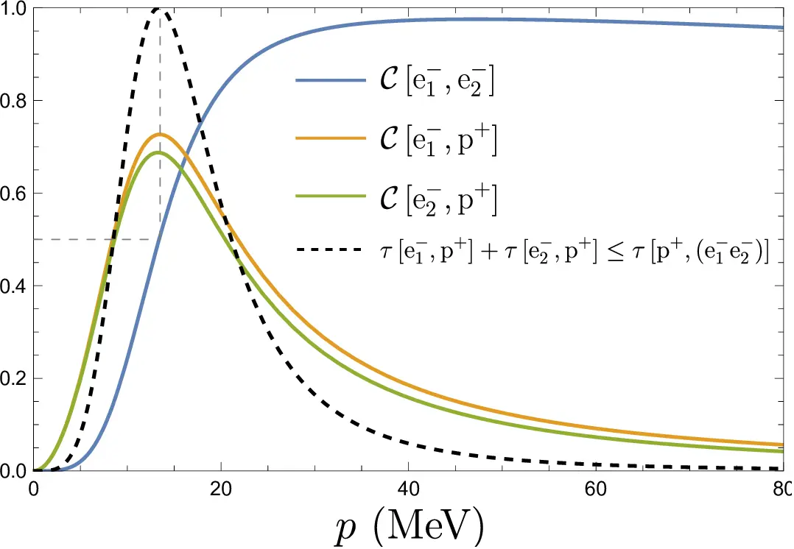

Quantum information is a fascinating field that merges the principles of quantum mechanics with information theory. It explores how quantum systems can be used to store, process, and transmit information in ways that surpass classical limits. In this article, we will delve into the basics of quantum information, its unique properties, and its potential applications.

## Quantum Bits: The Fundamental Units of Quantum Information

At the core of quantum information lies the concept of quantum bits, or qubits. While classical bits can only exist in two states, 0 or 1, qubits can exist in a superposition of states. Mathematically, a qubit can be represented as:

$$|\psi\rangle = \alpha |0\rangle + \beta |1\rangle$$

Here, \(|\psi\rangle\) represents the qubit state, \(\alpha\) and \(\beta\) are complex numbers, and \(|0\rangle\) and \(|1\rangle\) are the basis states.

The superposition property allows qubits to represent multiple values simultaneously, leading to exponential parallelism in quantum computation. Additionally, qubits can be entangled, meaning their states become correlated, even when physically separated. Entanglement enables the encoding of information across multiple qubits, creating powerful quantum resources.

## Quantum Gates and Quantum Algorithms

In classical computing, logic gates manipulate bits to perform computations. Similarly, in quantum computing, quantum gates act on qubits to perform operations. Quantum gates exploit the principles of quantum mechanics to perform transformations such as rotations, flips, and entanglement operations.

Quantum algorithms leverage the power of qubits and quantum gates to solve certain problems more efficiently than classical algorithms. One such example is Shor's algorithm, which can factor large numbers exponentially faster than classical methods. This has implications for cryptography and poses both a challenge and an opportunity for secure communication systems.

## Quantum Entanglement and Quantum Teleportation

Quantum entanglement, a striking feature of quantum information, enables instantaneous correlation between entangled particles. It allows for secure communication and novel communication protocols such as quantum teleportation. Quantum teleportation is a process where the exact state of a qubit is transferred from one location to another, without physically moving the qubit itself.

The process of quantum teleportation involves entangling two particles, performing measurements on one particle, and transmitting the measurement results. Through this process, the state of the original qubit is faithfully transferred to the distant entangled particle.

## Quantum Information and Quantum Cryptography

Quantum information has significant implications for secure communication and cryptography. Quantum key distribution (QKD) is a cryptographic protocol that utilizes the principles of quantum mechanics to secure the exchange of encryption keys. It relies on the fundamental properties of qubits, such as the no-cloning theorem, to ensure the security of the key exchange process.

QKD provides a means for secure communication by detecting any eavesdropping attempts, as any measurement of qubits disturbs their states. This allows two parties to establish a shared secret key that can be used for secure communication using classical encryption algorithms.

## Potential Applications and Future Prospects

Quantum information has the potential to revolutionize various fields. Quantum computing, with its ability to tackle complex problems exponentially faster, may transform areas such as optimization, simulation of physical systems, and machine learning. Quantum cryptography offers enhanced security for sensitive communication, protecting against potential threats from quantum computers.

While quantum information technologies are still in their infancy, ongoing research and technological advancements continue to push the boundaries of what is possible. As scientists and engineers explore the realm of quantum information, we can anticipate breakthroughs that will shape the future of computing, communication, and data processing.

## Conclusion

Quantum information combines the principles of quantum mechanics and information theory to create a new paradigm of computing, communication, and cryptography. Qubits, the building blocks of quantum information, possess unique properties such as superposition and entanglement, which enable powerful quantum computations and secure communication protocols. As research progresses and technologies mature, quantum information holds the potential to revolutionize various fields and pave the way for exciting advancements in science and technology.

Some simple mathematical expressions:

$$ \sqrt{3x-1}+(1+x)^2 $$

$$\frac{ax^2+bx+c}{(a+b)^2}=0$$

$$f(x) = \pm A \sin\left(\frac{2\pi}{4} + \theta\right)$$

More complicated examples (from [KateX home page](https://katex.org)):

$$\displaystyle \frac{1}{\Bigl(\sqrt{\phi \sqrt{5}}-\phi\Bigr) e^{\frac25 \pi}} = 1+\frac{e^{-2\pi}} {1+\frac{e^{-4\pi}} {1+\frac{e^{-6\pi}} {1+\frac{e^{-8\pi}} {1+\cdots} } } }$$

$$\displaystyle \left( \sum_{k=1}^n a_k b_k \right)^2 \leq \left( \sum_{k=1}^n a_k^2 \right) \left( \sum_{k=1}^n b_k^2 \right)$$

$$\displaystyle {1 +  \frac{q^2}{(1-q)}+\frac{q^6}{(1-q)(1-q^2)}+\cdots }= \prod_{j=0}^{\infty}\frac{1}{(1-q^{5j+2})(1-q^{5j+3})}, \quad\quad \text{for }\lvert q\rvert<1.$$

<!--  -->

*Remember to stay curious as we journey further into the fascinating world of quantum information!*
