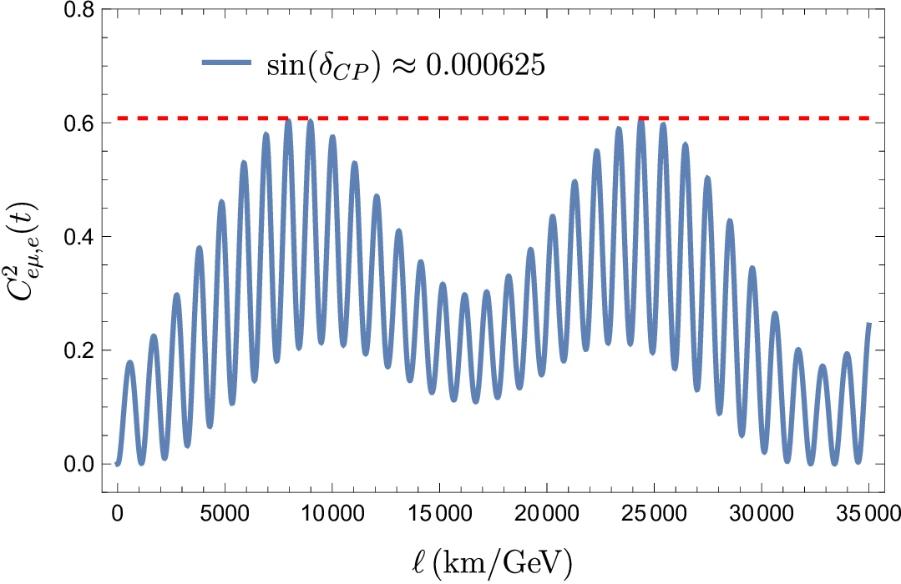
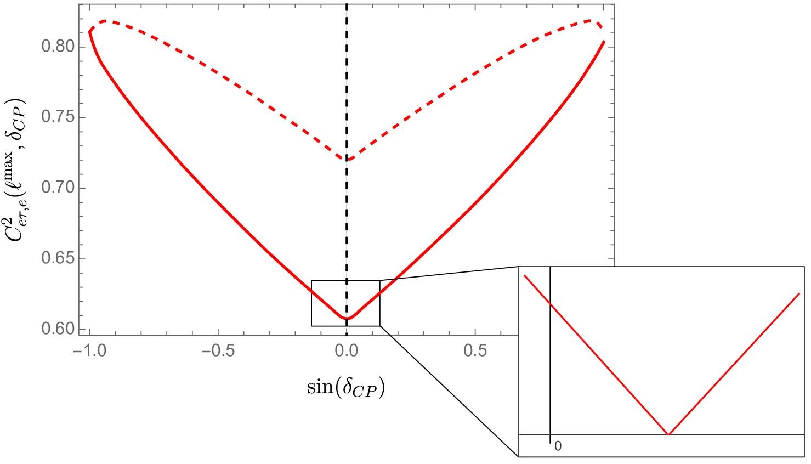

## Quantum Bits: The Fundamental Units of Quantum Information

At the core of quantum information lies the concept of quantum bits, or qubits. While classical bits can only exist in two states, 0 or 1, qubits can exist in a superposition of states. Mathematically, a qubit can be represented as:

$$|\psi\rangle = \alpha |0\rangle + \beta |1\rangle$$

Here, $|\psi\rangle$ represents the qubit state, $\alpha$ and $\beta$ are complex numbers, and $|0\rangle$ and $|1\rangle$ are the basis states.

The superposition property allows qubits to represent multiple values simultaneously, leading to exponential parallelism in quantum computation. Additionally, qubits can be entangled, meaning their states become correlated, even when physically separated. Entanglement enables the encoding of information across multiple qubits, creating powerful quantum resources.

## Entaglement in Neutrinos Flavours

Neutrinos, usually represente dby $\nu$, have a property called flavour: this is the value of a quantum operator which can assume 3 values. The special fact about neutrinos is that they can exist in a quantum superposition of all 3 flavours, of the form

$$ \ket{\nu_\alpha(t)} = U_{\alpha e}(t) \ket{100} + U_{\alpha \mu}(t) \ket{010} + U_{\alpha \tau}(t) \ket{001} $$

where $\alpha$ represents the flavour of the neutrino. As any qubit quantum state, one may calculate the entanglement present in the qubit degrees of freedom. Due to the particular form of the operator $U$, the resulting entanglement is a oscillatory function, like the picture below:

## Using entaglement to constrain fundamental parameter values

The $U$ represent a unitary matrix associated to rotations between flavours, containing particular fundamental constants. One of those constants is $\delta_{CP}$, a phase responsible for the amount of charge-parity violation within neutrino interactions.

Currently, not only there's no explanattion for the value of $\delta_{CP}$ but it's experimental error is very large. It would be curious then, to somehow related the quantum entaglement of neutrinos flavour degrees of freedom to constrain the value of $\delta_{CP}$. In particular, interpreting quantum entanglement as a resource, it is tentative to look at points where it is minimised and determine the value of $\delta_{CP}$ at those points. The picture below represents such minisation:

As it turns out, flavour entanglement is minimised for a single point, giving the specific prediction for the charge-parity violation phase of the form

$$ \sin(\delta^{\textrm{NO}}_{CP}) = 6.3^{+47.2}_{-61.7} \times 10^{-4}, \quad  \sin(\delta^{\textrm{IO}}_{CP}) = -3.64^{+72.3}_{-36.0} \times 10^{-4}  $$

depending on the so-called Normal Ordering (NO) or Inverted Ordering of the yet unkown neutrino masses.
