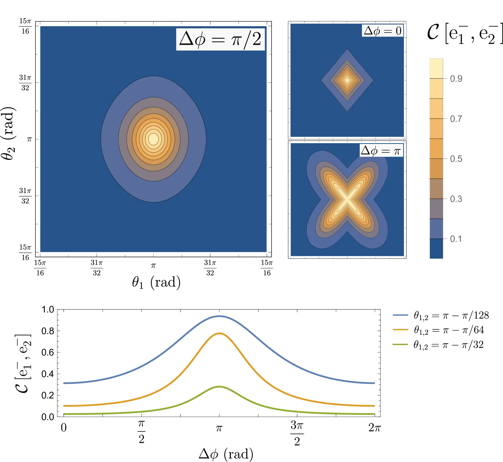
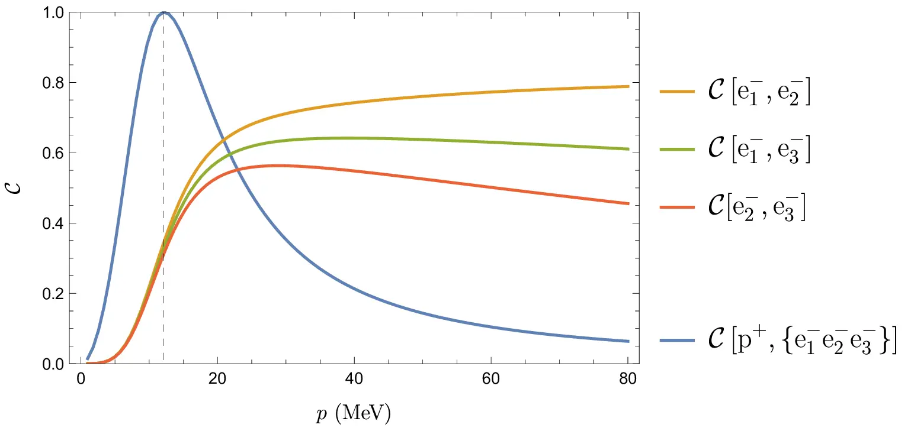

## Entanglement from particle scatterings

In a typical quantum scattering, distant particles interact as an initial separable quantum state $|\psi_i \rangle$ to form a final quantum state $|\psi_f\rangle$. If the quantum properties of this state, such as spin or helicity, are not measured, the state will be in a superposition of all possible outgoing properties. In other words, the outgoing state will in general have quantum entanglement, even if the initial state of the combined particles was separable. This is contained in the general form of the outgoing state:

$$ \ket{\psi(t_f)} = \ket{\psi(t_i)} + i (2\pi)^4 \int \frac{d^3 \boldsymbol{q}_1}{(2\pi)^3 2E_{\boldsymbol{q}_1}} \ldots \frac{d^3 \boldsymbol{q}_n}{(2\pi)^3 2E_{\boldsymbol{q}_n}} \delta^{(4)}\left(\sum q_i - \sum p_i\right) \times \sum_{r_1, \ldots, r_n}  \mathcal{M}(\boldsymbol{q}_1, r_1; \ldots; \boldsymbol{q}_n, r_n | \boldsymbol{p}_1, h_1; \ldots; \boldsymbol{p}_n, h_n) \times \ket{\boldsymbol{q}_1, r_1; \ldots; \boldsymbol{q}_n, r_n} $$

where $\mathcal{M}(\boldsymbol{q}_1, r_1; \ldots; \boldsymbol{q}_n, r_n | \boldsymbol{p}_1, h_1; \ldots; \boldsymbol{p}_n, h_n)$ is the probability amplitude of $N$ particles with momenta $\boldsymbol{p}_1, \ldots, \boldsymbol{p}_n$ and helicities $h_1, \ldots, h_n$, scattering off into $N$ particles with momenta $\boldsymbol{q}_1, \ldots, \boldsymbol{q}_n$ and helicities $r_1, \ldots, r_n$. The form of $|\psi_f \rangle$ will not be able, in most cases, to be written as a tensor product state, i.e. it will be entangled.

## Firing particles from a source into a central particle

A particularly interesting case to study is when particles from a single source scatter off a heavier target particle, initially at rest. By entangling each projectile with the target particle, all projectiles become entangled between themselves, even though they did not interact with one another. The target particle should also be heavier, otherwise it will change it's motion, rendering it impossible to be hit by other projectile particles.

Computationaly, we simply consider consecutive initial 2-particle scatterings, where the target particle is hit with projectile particles with the same properties. One can show that the entanglement generated from 2 such scatterings, for example, has the properties shown in the following figure:

For this case, we use electrons as the projectile particles and a proton as the target particle. One can see that the entanglement generated, as quantified by the concurrence $\mathcal{C}$, is larger and maximal for the case where the two electrons are refledted back in the same direction and on opposite sides of the cone formed by their directions.

## Limits for many collisions

As more projectile particles collide with the target particle, the entanglement between pairs of projectiles starts to fade. We can see this already for 3 collisions in the following figure:

It becomes apparent that the bi-partite entanglement between the latest pairs of electrons is increasingly smaller, as is the entanglement between the target/projectiles subsystems. Nevrtheless, there is alwas a momentum of the fired particles for which the entanglement with the target is maximal.

